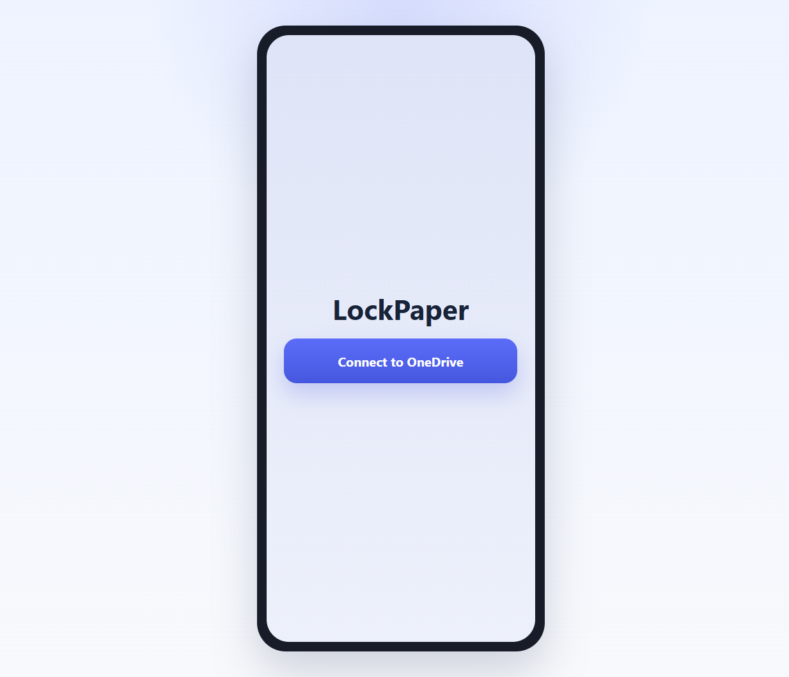
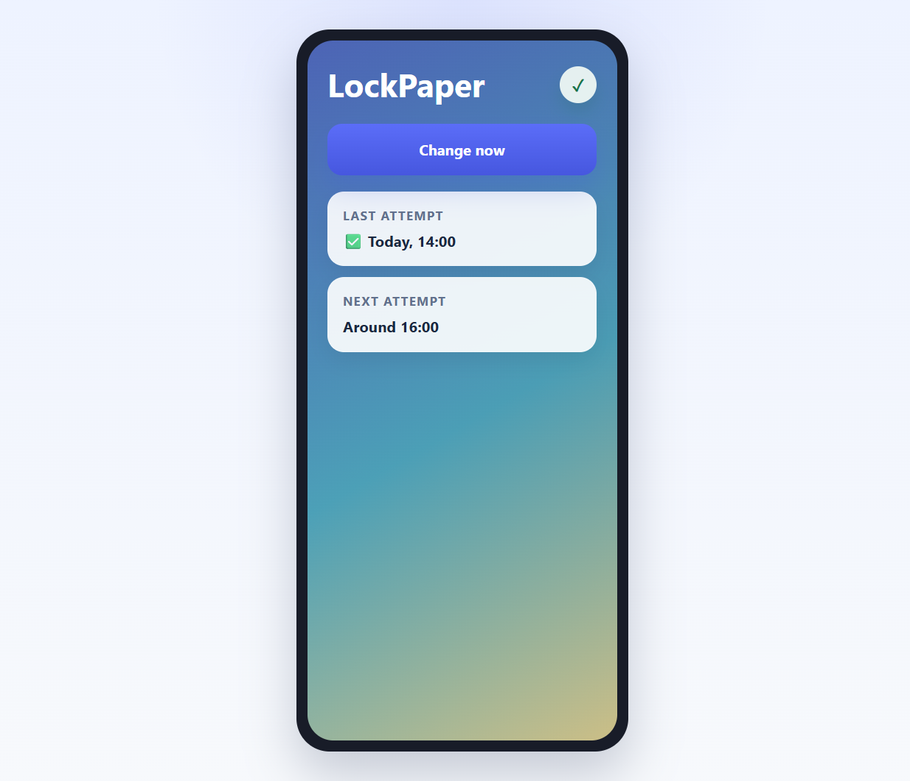

# LockPaper Specifications

LockPaper is a cross-platform app for **Windows** and **Android** that updates a user's **lock-screen wallpaper** from favorite photos stored in a OneDrive album. The v1 experience is intentionally small: connect a personal Microsoft account, find the user's curated album, rotate the lock-screen image on a best-effort hourly cadence, and provide a simple screen to trigger a manual refresh.

>This app is intended for an audience of one: basically me. So the product should favor a very minimal UI and low ceremony over broad configurability.

## Current UI placeholders

These placeholder screenshots were generated from the current HTML mockups and are here to keep the product spec visually anchored while the app UI is still being implemented.

### Disconnected state

Source mockup: `docs/ui-mockups/LockPaperDisconnected/index.html`

### Connected state

Source mockup: `docs/ui-mockups/LockPaperConnected/index.html`

### No albums found state

This connected-state error mockup shows how LockPaper should explain that wallpaper rotation is paused until a matching OneDrive album exists.

Source mockup: `docs/ui-mockups/NoAlbumsFound/index.html`

## Product goals

- Make lock-screen rotation from OneDrive feel automatic and low-maintenance.
- Keep setup simple enough for a single user to complete in a few minutes.
- Prefer photos that match the device's current orientation before falling back to any available photo.
- Preserve a consistent core behavior across Windows and Android while respecting platform limits.
- Keep the UI intentionally sparse because the product is meant for a tiny personal/family audience rather than a broad consumer user base.

## V1 scope

- Personal Microsoft account sign-in.
- OneDrive album discovery using the case-insensitive names `lockpaper`, `lock-paper`, or `lock paper`.
- Lock-screen wallpaper updates only.
- Random photo selection from the discovered album.
- Orientation-aware filtering before fallback selection.
- Best-effort hourly background refresh.
- A minimal in-app screen with:
  - current connection/status summary, including the signed-in Microsoft account
  - a wallpaper album status card that shows whether any matching albums are ready
  - one display summary card that keeps every detected screen, monitor, or display grouped together as simple rectangles with each display's resolution shown inside its rectangle and the current lock-screen wallpaper thumbnail shown behind the text when one is available
  - a manual "change wallpaper now" action
  - basic success and error feedback

## Out of scope for v1

- Desktop wallpaper changes.
- Microsoft 365 work or school account support.
- User-configurable schedules.
- Rich gallery browsing, preview, or photo management.
- Advanced repeat-avoidance or shuffle logic.
- Editing or creating OneDrive albums from within the app.

## Primary user flow

1. The user installs LockPaper and signs in with a personal Microsoft account.
2. LockPaper immediately scans OneDrive for albums named `lockpaper`, `lock-paper`, or `lock paper`, ignoring case.
3. If no matching albums exist, LockPaper keeps the account connected, shows a clear error, and pauses wallpaper rotation until a matching album is available.
4. If one matching album exists, LockPaper uses it. If multiple matching albums exist, LockPaper randomly selects one matching album for the current wallpaper change cycle.
5. LockPaper reads the current device resolution and orientation.
6. LockPaper filters album photos to prefer the matching orientation:
   - portrait-first for portrait devices
   - landscape-first for landscape devices
7. If matching-orientation photos exist, LockPaper randomly selects one of them.
8. If no photos match the device orientation, LockPaper randomly selects any photo from the chosen album.
9. LockPaper applies the photo to the lock screen.
10. LockPaper repeats the process on a best-effort hourly cadence and also when the user taps the manual change button.

## Functional requirements

### FR1. Account and access

- The app must allow the user to sign in with a **personal Microsoft account**.
- The app must request only the OneDrive access needed to discover the target album and read photo files or metadata required for wallpaper selection.
- The app must show when the user is signed out, signed in, or needs to re-authenticate.

### FR2. Album discovery

- The app must search for a OneDrive album whose name equals `lockpaper`, `lock-paper`, or `lock paper`, case-insensitively.
- The app must treat the album name match as an exact text match after case normalization.
- The app must try to read the user's albums as soon as the OneDrive connection becomes available and whenever the connected state is refreshed.
- If no matching album exists, the app must surface a clear status message and must not attempt wallpaper rotation until a matching album is available.
- If multiple matching albums exist, the app must randomly choose one matching album when running a wallpaper change cycle.

### FR3. Photo eligibility and selection

- The app must evaluate device resolution and orientation before selecting a photo.
- For portrait devices, the app should prefer portrait-oriented photos.
- For landscape devices, the app should prefer landscape-oriented photos.
- If the chosen album has no photos that match the current device orientation, the app must fall back to a random photo from the full album.
- The v1 selection strategy is **pure random**; repeats are allowed.
- The app should ignore non-image items and files that cannot be used as wallpapers on the current platform.

### FR4. Wallpaper refresh cadence

- The app should attempt to refresh the lock-screen wallpaper **every hour**, targeting the top of the hour where platform scheduling allows it.
- The app must treat this cadence as **best effort**, not guaranteed real-time execution.
- If the operating system delays or suppresses a scheduled run, the app should perform the next wallpaper change at the next available background execution opportunity.
- The app must allow the user to trigger a wallpaper change manually at any time while signed in.
- All displayed times, last-attempt timestamps, and wallpaper refresh scheduling references must use the **device's local time**.
- The v1 spec explicitly ignores time-zone crossover handling and cross-device time-zone reconciliation.

### FR5. Wallpaper application

- The app must update the **lock-screen wallpaper** on supported Windows and Android devices.
- The app must use platform-specific wallpaper APIs or platform-supported mechanisms rather than trying to simulate the change in-app.
- The app should store enough local state to report the last attempted wallpaper change and its outcome.
- **Open product question:** the exact photo fitting policy for mismatched aspect ratios is not finalized. The first implementation may rely on platform-default fitting behavior until a final rule is chosen.

### FR6. Minimal UI

- The main screen must expose a single prominent action to change the wallpaper immediately.
- The main screen must show basic status, including:
  - sign-in state through a Microsoft account card
  - wallpaper album state through a dedicated status card
  - a single display summary card for the attached screen or monitors, using the current lock-screen wallpaper thumbnail when it is available and the existing solid-color fallback otherwise, with the resolution shown inside each display rectangle
  - whether a matching album was found
  - the last change attempt result
  - the next scheduled attempt target or scheduling state
- On Windows, the display summary card may show more than one attached monitor at the same time.
- On Android, the display summary should normally show the current device screen only.
- The v1 UI does not need a full settings surface.

### FR7. Feedback and failure states

- The app must clearly communicate these states to the user:
  - signed out
  - matching album not found
  - chosen album has no eligible photos
  - manual change in progress
  - last change succeeded
  - last change failed
- When no matching album exists, the UI should explain that the user can create or rename an album to `lockpaper`, `lock-paper`, or `lock paper`.
- The app should provide user-friendly failure messages for connectivity, permission, and platform capability issues.

## Assumptions and constraints

- The repository's current app direction is **.NET MAUI** targeting Android and Windows, so the product spec assumes a shared cross-platform UI shell with platform-specific wallpaper services.
- Background execution behavior is controlled by the operating system; Android in particular may defer exact hourly runs.
- Users are responsible for curating the OneDrive album contents.
- Users may rotate between portrait and landscape devices; the app should evaluate orientation per device at runtime rather than assuming one fixed preference.
- Time-related UI and scheduling behavior should be interpreted in the current device's local time zone.
- Windows devices may expose multiple attached monitors, while Android devices will usually report a single built-in screen.

## Open questions

- Should LockPaper explicitly crop images to fill the lock screen, preserve the full image with padding, or defer entirely to the platform's default wallpaper fitting behavior?

## Initial implementation workstreams

1. **Authentication and OneDrive access**: sign-in flow, token handling, and Microsoft Graph integration for personal accounts.
2. **Album discovery and metadata sync**: locate candidate albums, read photo metadata, and normalize orientation details.
3. **Selection engine**: implement orientation-aware random picking with fallback behavior.
4. **Platform wallpaper services**: create Windows and Android services that apply lock-screen wallpapers and report result status.
5. **Scheduling and persistence**: track last run, next best-effort run target, and recent outcome.
6. **Minimal UI**: build the status screen and manual change action described in `docs/specs/ui.md`.
7. **Testing**: cover album discovery, selection rules, platform abstractions, and view-model logic with automated tests.

## Related spec files

- `docs/specs/ui.md` - UI-specific requirements for the v1 status screen.
- `docs/specs/future.md` - deferred ideas and out-of-scope enhancements.
